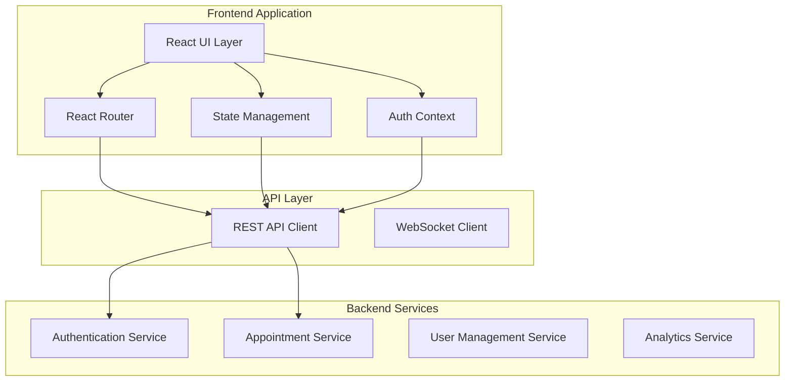

# Design Document

## Overview

The Mental Hospital Admin Panel is a comprehensive web-based management system built with React, TypeScript, Vite, and Tailwind CSS. The application follows a modular architecture with role-based access control, providing different interfaces and capabilities for six distinct user roles: Admin, Manager, Centre Manager, Clinician, Care Coordinator, and Front Desk.

The design emphasizes a modern, sleek aesthetic using a dark theme (#293346) with teal (#2CA5A9) and deep blue (#2a1470) accents, inspired by the Mibo Care design language. The interface prioritizes data visualization, quick access to critical information, and efficient workflows for healthcare operations management.

### Key Design Principles

1. **Role-Based UI Adaptation**: Interface elements dynamically adjust based on user role and permissions
2. **Data-First Dashboard**: Analytics and metrics are prominently displayed for quick decision-making
3. **Responsive Design**: Optimized for desktop screens (1024px - 1920px)
4. **Accessibility**: WCAG 2.1 AA compliant with proper color contrast and keyboard navigation
5. **Performance**: Lazy loading, code splitting, and optimized rendering for smooth user experience

## Architecture

### High-Level Architecture



    API --> UserService
    API --> AnalyticsService
    WS --> AppointmentService

    DB[(Database)]
    AuthService --> DB
    AppointmentService --> DB
    UserService --> DB
    AnalyticsService --> DB

```

### Technology Stack

- **Frontend Framework**: React 19.2.0 with TypeScript 5.9.3
- **Build Tool**: Vite 7.2.4
- **Styling**: Tailwind CSS 3.4.18
- **Routing**: React Router v6
- **State Management**: React Context API + Custom Hooks
- **Charts**: Recharts or Chart.js for data visualization
- **HTTP Client**: Axios for API communication
- **Form Management**: React Hook Form with Zod validation
- **Date Handling**: date-fns
- **Icons**: Lucide React or Heroicons
- **Notifications**: React Hot Toast

### Folder Structure

```

src/
├── assets/ # Static assets (images, fonts)
├── components/ # Shared components
│ ├── ui/ # Base UI components (Button, Input, Card, etc.)
│ ├── charts/ # Chart components
│ ├── forms/ # Form components
│ └── tables/ # Table components
├── contexts/ # React contexts
│ ├── AuthContext.tsx
│ ├── ThemeContext.tsx
│ └── NotificationContext.tsx
├── hooks/ # Custom React hooks
│ ├── useAuth.ts
│ ├── useApi.ts
│ └── usePermissions.ts
├── layouts/ # Layout components
│ └── AdminLayout/
│ ├── AdminLayout.tsx
│ ├── Header.tsx
│ └── Sidebar.tsx
├── modules/ # Feature modules
│ ├── auth/
│ ├── dashboard/
│ ├── appointments/
│ ├── patients/
│ ├── centres/
│ ├── staff/
│ └── settings/
├── router/ # Routing configuration
├── services/ # API services
│ ├── api.ts
│ ├── authService.ts
│ ├── appointmentService.ts
│ └── analyticsService.ts
├── types/ # TypeScript type definitions
├── utils/ # Utility functions
└── constants/ # Constants and configurations

````

## Components and Interfaces

### Core Layout Components

#### 1. AdminLayout

The main layout wrapper that provides the structure for all authenticated pages.

**Props:**
```typescript
interface AdminLayoutProps {
  children?: React.ReactNode;
}
````

**Structure:**

- Fixed header at the top
- Fixed sidebar on the left (240px width)
- Main content area with padding and scroll
- Responsive breakpoints for tablet/mobile

#### 2. Header Component

Top navigation bar with branding, search, and user controls.

**Features:**

- Logo (top left)
- Global search bar (center)
- Notification bell with badge
- User profile dropdown (top right)
- Settings icon
- Logout button

**Props:**

```typescript
interface HeaderProps {
  user: {
    name: string;
    role: UserRole;
    avatar?: string;
  };
  onLogout: () => void;
}
```

#### 3. Sidebar Component

Vertical navigation menu with role-based menu items.

**Features:**

- Collapsible sections (Main, Staff, Settings)
- Active route highlighting
- Icon + text labels
- Role-based menu filtering
- Smooth hover animations

**Props:**

```typescript
interface SidebarProps {
  userRole: UserRole;
  currentPath: string;
}

interface MenuItem {
  id: string;
  label: string;
  icon: React.ComponentType;
  path: string;
  roles: UserRole[];
  section: "main" | "staff" | "settings";
}
```

### Dashboard Components

#### 1. StatCard Component

Displays key metrics with trend indicators.

**Props:**

```typescript
interface StatCardProps {
  title: string;
  value: number | string;
  icon: React.ComponentType;
  trend?: {
    value: number;
    direction: "up" | "down";
    period: string;
  };
  sparkline?: number[];
}
```

**Visual Design:**

- Dark card background (#1e2836)
- Teal or blue accent for icon
- Large value display
- Small trend indicator with percentage
- Optional mini sparkline chart

#### 2. DonutChart Component

Circular chart for categorical data (e.g., Leads by Source).

**Props:**

```typescript
interface DonutChartProps {
  data: Array<{
    label: string;
    value: number;
    color: string;
  }>;
  title: string;
  centerLabel?: string;
}
```

#### 3. AreaChart Component

Time-series chart for revenue and trends.

**Props:**

```typescript
interface AreaChartProps {
  data: Array<{
    date: string;
    value: number;
  }>;
  title: string;
  color: string;
  gradient?: boolean;
}
```

#### 4. TopDoctorsCard Component

List of top-performing clinicians.

**Props:**

```typescript
interface TopDoctorsCardProps {
  doctors: Array<{
    id: string;
    name: string;
    specialty: string;
    avatar: string;
    patientCount: number;
  }>;
}
```

### Authentication Components

#### 1. LoginForm Component

Multi-method authentication form.

**Features:**

- Tab switcher: "Phone + OTP" | "Username/Password"
- Phone input with country code selector
- OTP input (6 digits)
- Username/password fields
- Remember me checkbox
- Form validation with error messages

**Props:**

```typescript
interface LoginFormProps {
  onSubmit: (credentials: LoginCredentials) => Promise<void>;
  loading: boolean;
}

type LoginCredentials =
  | { method: "phone-otp"; phone: string; otp: string }
  | { method: "phone-password"; phone: string; password: string }
  | { method: "username-password"; username: string; password: string };
```

### Appointment Components

#### 1. AppointmentCalendar Component

Calendar view for appointment scheduling.

**Features:**

- Month/week/day views
- Drag-and-drop rescheduling
- Color-coded by status
- Click to view details
- Filter by clinician/centre

**Props:**

```typescript
interface AppointmentCalendarProps {
  appointments: Appointment[];
  onSelectSlot: (slot: TimeSlot) => void;
  onReschedule: (appointmentId: string, newSlot: TimeSlot) => void;
  view: "month" | "week" | "day";
}
```

#### 2. BookingForm Component

Form for creating new appointments.

**Props:**

```typescript
interface BookingFormProps {
  centres: Centre[];
  onSubmit: (booking: BookingData) => Promise<void>;
}

interface BookingData {
  patientName: string;
  patientPhone: string;
  centreId: string;
  clinicianId: string;
  slotId: string;
  notes?: string;
}
```

#### 3. AppointmentTable Component

Tabular view of appointments with filters and actions.

**Features:**

- Sortable columns
- Status filters
- Date range picker
- Bulk actions
- Export to CSV
- Pagination

**Props:**

```typescript
interface AppointmentTableProps {
  appointments: Appointment[];
  columns: ColumnDef[];
  onStatusChange: (id: string, status: AppointmentStatus) => void;
  onCancel: (id: string) => void;
}
```

### Staff Management Components

#### 1. StaffTable Component

Generic table for managing staff members.

**Props:**

```typescript
interface StaffTableProps {
  staff: StaffMember[];
  role: UserRole;
  onAdd: () => void;
  onEdit: (id: string) => void;
  onDelete: (id: string) => void;
}
```

#### 2. StaffForm Component

Form for adding/editing staff members.

**Props:**

```typescript
interface StaffFormProps {
  role: UserRole;
  initialData?: StaffMember;
  centres: Centre[];
  onSubmit: (data: StaffFormData) => Promise<void>;
}
```

### Shared UI Components

#### 1. Button Component

**Variants:**

- primary (teal background)
- secondary (outline)
- danger (red for delete actions)
- ghost (transparent)

**Sizes:** sm, md, lg

#### 2. Input Component

Text input with label, error message, and icon support.

#### 3. Select Component

Dropdown selector with search capability.

#### 4. Modal Component

Overlay dialog for forms and confirmations.

#### 5. Table Component

Data table with sorting, filtering, and pagination.

#### 6. Card Component

Container with consistent padding and styling.

## Data Models

### User Model

```typescript
interface User {
  id: string;
  name: string;
  email?: string;
  phone: string;
  username?: string;
  role: UserRole;
  avatar?: string;
  centreIds: string[]; // Centres this user has access to
  createdAt: Date;
  updatedAt: Date;
  lastLogin?: Date;
  isActive: boolean;
}

type UserRole =
  | "admin"
  | "manager"
  | "centre_manager"
  | "clinician"
  | "care_coordinator"
  | "front_desk";
```

### Centre Model

```typescript
interface Centre {
  id: string;
  name: string;
  location: string;
  city: "bangalore" | "kochi" | "mumbai";
  address: string;
  phone: string;
  email: string;
  managerId?: string;
  isActive: boolean;
  createdAt: Date;
  updatedAt: Date;
}
```

### Clinician Model

```typescript
interface Clinician {
  id: string;
  userId: string; // Reference to User
  specialization: string;
  qualification: string;
  experience: number; // years
  centreId: string;
  consultationFee: number;
  isAvailable: boolean;
  workingHours: WorkingHours[];
}

interface WorkingHours {
  dayOfWeek: number; // 0-6
  startTime: string; // HH:mm
  endTime: string; // HH:mm
}
```

### Appointment Model

```typescript
interface Appointment {
  id: string;
  patientId: string;
  clinicianId: string;
  centreId: string;
  slotId: string;
  date: Date;
  startTime: string;
  endTime: string;
  status: AppointmentStatus;
  type: "first-visit" | "follow-up";
  notes?: string;
  cancellationReason?: string;
  createdBy: string; // User ID
  createdAt: Date;
  updatedAt: Date;
}

type AppointmentStatus =
  | "scheduled"
  | "confirmed"
  | "in-progress"
  | "completed"
  | "cancelled"
  | "no-show";
```

### Patient Model

```typescript
interface Patient {
  id: string;
  name: string;
  phone: string;
  email?: string;
  dateOfBirth?: Date;
  gender?: "male" | "female" | "other";
  address?: string;
  emergencyContact?: {
    name: string;
    phone: string;
    relationship: string;
  };
  medicalHistory?: string;
  createdAt: Date;
  updatedAt: Date;
}
```

### TimeSlot Model

```typescript
interface TimeSlot {
  id: string;
  clinicianId: string;
  centreId: string;
  date: Date;
  startTime: string;
  endTime: string;
  duration: number; // minutes
  status: "available" | "booked" | "blocked";
  appointmentId?: string;
}
```

### Analytics Models

```typescript
interface DashboardMetrics {
  totalPatients: number;
  totalPatientsChange: number; // percentage
  activeDoctors: number;
  activeDoctorsChange: number;
  followUpsBooked: number;
  followUpsBookedChange: number;
  totalRevenue: number;
  totalRevenueChange: number;
}

interface LeadsBySource {
  website: number;
  phone: number;
  direct: number;
  referrals: number;
}

interface RevenueDataPoint {
  date: string;
  revenue: number;
}

interface TopDoctor {
  clinicianId: string;
  name: string;
  specialty: string;
  avatar: string;
  patientCount: number;
}
```

## Error Handling

### Error Types

```typescript
interface ApiError {
  code: string;
  message: string;
  field?: string;
  details?: Record<string, any>;
}

type ErrorCode =
  | "AUTH_FAILED"
  | "INVALID_CREDENTIALS"
  | "SESSION_EXPIRED"
  | "PERMISSION_DENIED"
  | "RESOURCE_NOT_FOUND"
  | "VALIDATION_ERROR"
  | "SLOT_UNAVAILABLE"
  | "DUPLICATE_BOOKING"
  | "NETWORK_ERROR"
  | "SERVER_ERROR";
```

### Error Handling Strategy

1. **API Errors**: Caught in service layer, transformed to user-friendly messages
2. **Validation Errors**: Displayed inline on form fields
3. **Network Errors**: Global toast notification with retry option
4. **Authentication Errors**: Redirect to login with return URL
5. **Permission Errors**: Show 403 page with explanation

### Error Boundaries

```typescript
class ErrorBoundary extends React.Component {
  // Catches React rendering errors
  // Displays fallback UI
  // Logs error to monitoring service
}
```

## Testing Strategy

### Unit Testing

**Tools**: Vitest + React Testing Library

**Coverage Targets:**

- Utility functions: 90%
- Custom hooks: 85%
- Components: 80%

**Test Categories:**

- Component rendering
- User interactions
- State management
- Form validation
- API service functions

### Integration Testing

**Focus Areas:**

- Authentication flow
- Appointment booking flow
- Role-based access control
- Data fetching and caching

### E2E Testing

**Tools**: Playwright or Cypress

**Critical Paths:**

- Login → Dashboard → Book Appointment
- Login → View Appointments → Reschedule
- Login → Manage Staff → Add Clinician
- Login → View Reports → Export Data

### Accessibility Testing

**Tools**: axe-core, WAVE

**Checks:**

- Keyboard navigation
- Screen reader compatibility
- Color contrast ratios
- ARIA labels and roles
- Focus management

## Performance Optimization

### Code Splitting

- Route-based splitting (each module lazy loaded)
- Component-level splitting for heavy components (charts, tables)

### Data Fetching

- React Query for caching and background updates
- Optimistic updates for better UX
- Pagination for large datasets
- Debounced search inputs

### Rendering Optimization

- React.memo for expensive components
- useMemo/useCallback for computed values
- Virtual scrolling for long lists
- Lazy loading images

### Bundle Optimization

- Tree shaking unused code
- Minification and compression
- CDN for static assets
- Service worker for offline support

## Security Considerations

### Authentication

- JWT tokens stored in httpOnly cookies
- Refresh token rotation
- Session timeout after 24 hours of inactivity
- Account lockout after 3 failed attempts

### Authorization

- Role-based access control (RBAC)
- Permission checks on both frontend and backend
- API endpoints protected with middleware
- Sensitive actions require re-authentication

### Data Protection

- HTTPS only
- Input sanitization
- XSS prevention
- CSRF tokens
- Rate limiting on API endpoints

### Audit Logging

- Log all authentication attempts
- Log all data modifications
- Track user actions for compliance
- Retain logs for 90 days

## Deployment Architecture

### Build Process

1. TypeScript compilation
2. Vite build (bundling, minification)
3. Asset optimization
4. Environment variable injection
5. Generate source maps

### Hosting

- Static hosting (Vercel, Netlify, or AWS S3 + CloudFront)
- CDN for global distribution
- Automatic SSL certificates
- Custom domain configuration

### CI/CD Pipeline

1. Code push to repository
2. Run linting and type checking
3. Run unit tests
4. Build production bundle
5. Deploy to staging
6. Run E2E tests
7. Deploy to production (manual approval)

### Monitoring

- Error tracking (Sentry)
- Performance monitoring (Web Vitals)
- User analytics (Google Analytics or Mixpanel)
- Uptime monitoring
- API response time tracking
